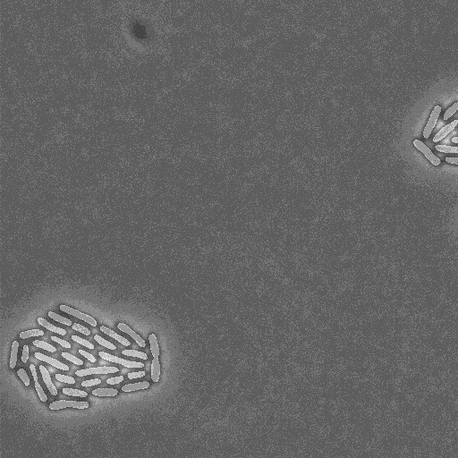

# cautious-octo-happiness

## Setting up the environment

If you wish to setup an environment to run this application I recommend installing [Anaconda](https://www.anaconda.com/), and then importing the **PhD_env.yml** file as a new environment.

Once that is done the application should be capable of running.

## U-Net CNN

This application uses the [U-Net architecture](https://paperswithcode.com/method/u-net) for each of the stages in its pipeline.

U-Net is a convolutional neural network (CNN) developed for the purposes of biomedical image segmentation. Characterised by its "U"-shaped network architecture, U-Net has demonstrated itself as the state-of-the-art convolutional neural network for biomedical imaging applications.

U-Nets' "U" shaped architecture is such that successive convolutional layers are progressively down-sampled in the contraction path, where spatial information is reduced and feature information is increased, whereas the expansive path combines both this feature and spatial information - each convolution is followed by a rectified linear unit (ReLU) and a max pooling operation.

## test_pipeline_tif.py

The file is used for testing data, by default this test script uses the config.2D.json file for defining run settings. This file is located at **data/config_2D.json**.

Settings that are changeable in this file are:

    "models": [
        "segmentation"
    ],
    "res_dir": "data/evaluation/beta/results,
    "project_dir": "data/evaluation/beta",
    "rotation_correction": false,
    "drift_correction": false,
    "min_cell_area": 10,
    "save_format": [
        "pickle",
        "legacy",
        "movie"
    ],
    "TF_CPP_MIN_LOG_LEVEL": "3"

- **models** - This defines which models to use.
    - Choices are ["segmentation"] OR ["segmentation", "tracking"].
    - ["segmentation", "tracking"] requires multiple images to work.
- **res_dir** - The output directory for results files.
- **project_dir** - The directory containing input images. 
- **rotation_correction** - Whether to apply rotation correction to input images.
- **drift_correction** - Whether to apply drift correction to input images.
- **min_cell_area** - Minimum area in pixels that a cell can be.
- **save_format** - The results output format.
    - **pickle** - a Python readable format.
    - **legacy** - a MATLAB compatible MAT file.
    - **movie** - a series of detailed images.
- **TF_CPP_MIN_LOG_LEVEL** - Tensorflow log level, 0 -> 3 = verbose -> less verbose

## Setup for new images to test

### Step 1

By default you require a brightfield image named "Position01Channel01Frames000001.jpg". The fluorescence image is called "Position01Channel02Frames000001.jpg" and is the same size as the brightfield one.

#### Position01Channel01Frames000001.jpg

#### Position01Channel02Frames000001.jpg

The only difference between one and the other is the "Channel01" in the brightfield file name and the "Channel02" in the fluorescence image name - there can be as many fluorescence images as needed, though each must be the same name as their respective brightfield image except for an increment in the "Channelx" part of the filename.

Note that fluorescence images are **not** necessary for the application to function. 

When the images are loaded, the cells of interest are segmented in the brightfield image (Position01Channel01Frames000001.jpg) and this "mask" is used to determine where the cell is that frames corresponding fluorescence frame.

Filenames must follow this pattern: **Position01Channel01Frames000001**.
- Incrementing **Channel01** implies an additional fluorescence channel.
- Incrementing **Frames000001** implies an extra frame.
- Incrementing **Position01** implies an extra camera position.

### Step 2

Ensure that "res_dir" and "project_dir" are correctly setup in the **config_2D.json** file and point to your project folder relative to the **test_pipeline_tif.py** script. If this script is kept in the root folder of the application, it will work as needed.

### Step 3

Run **test_pipeline_tif.py**, results are saved to the location defined by "res_dir".

I would recommend running the script without making any changes to the config file or the contents of the default test folder, just to ensure everything is setup correctly.

## Training image file structure

Training image file structure
Training is split into two parts for each of the respective U-Net implementations : segmentation and tracking. Each part requires specific images to be generated, the requirements for these are detailed below.

For the tracking part, the structure of the training sets is:

- **'previmg' folder:** Images from the previous time point/frame, i.e. the time from which we want to predict movement/tracking from. These are named as 'Sample00000x.png'.

- **'seg' folder:** Segmentation mages from the previous time point/frame for a single cell, i.e. the time from which we want to predict movement/tracking from.  These have been generated using iLastik. These are named as 'Sample00000x.png' and must match their corresponding image in the 'previmg' folder.

- **'img' folder:** Images from the current time point/frame, i.e. the time from which we want to predict movement/tracking for. These are named as 'Sample00000x.png'.

- **'segall' folder:** Segmentation images from the current time point/frame for all cell, i.e. the time from which we want to predict movement/tracking for.  These have been generated using iLastik. These are named as 'Sample00000x.png' and must match their corresponding image in the 'img' folder.

- **'mot-dau' folder:** Tracking maps. Outlines the tracking of the ‘seed’ cell into the current time point, or if it divided, of both cells that resulted from the division. A script will be made available soon to generate these from the relevant 'seg' folder segmentation images. 

- **'wei' folder:** Pixel-wise weight maps. These images are optional, though highly recommended to ensure accurate segmentation of cells located next to one another. These are used to help calculate the loss in regions of the image and to force U-Net to focus on these regions \textemdash in a sense it punishes U-Net for ignoring these regions. These are generated from the 'segall' and 'mot\_dau' folder images with tracking\_weights() function located in the 'data.py' script.  These are named as 'Sample00000x.png' and must match their corresponding image in the 'img' folder.

And for the segmentation part, the structure of the training sets is:

- **'img' folder:** Microscopy images, typically these will be phase-contrast images however bright-field or fluorescence images can be used \textemdash or indeed any combination of these. These are named as 'Sample00000x.png'.

- **'seg' folder:** Ground-truth images showing the segmentation of individual cells of interest. These have been generated using iLastik. These are named as 'Sample00000x.png' and must match their corresponding image in the 'img' folder.

- **'wei' folder:** Pixel-wise weight maps. These images are optional, though highly recommended to ensure accurate segmentation of cells located next to one another. These are used to help calculate the loss in regions of the image and to force U-Net to focus on these regions \textemdash in a sense it punishes U-Net for ignoring these regions. These are generated from the segmentation images using the 'seg\_weights\_2D()' function located in the 'data.py' script.  These are named as 'Sample00000x.png' and must match their corresponding image in the 'img' folder.

